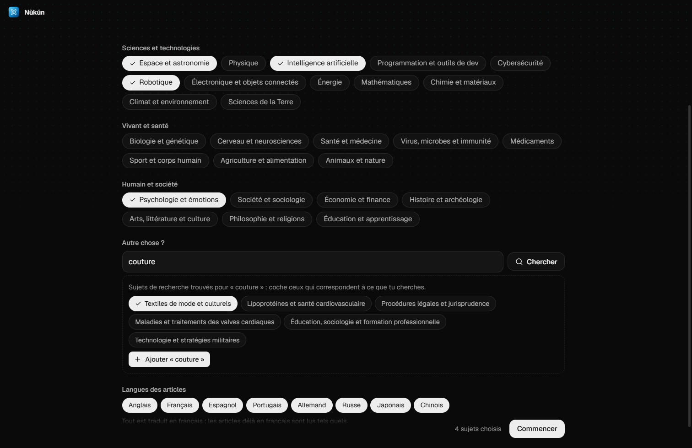
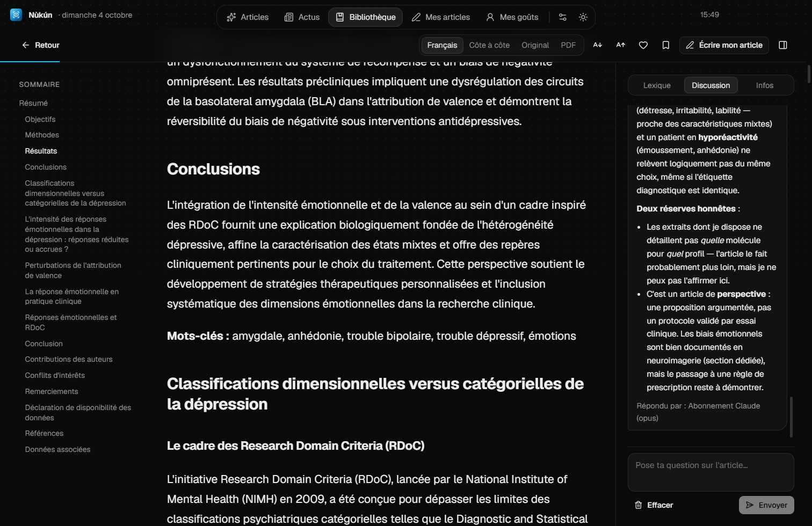
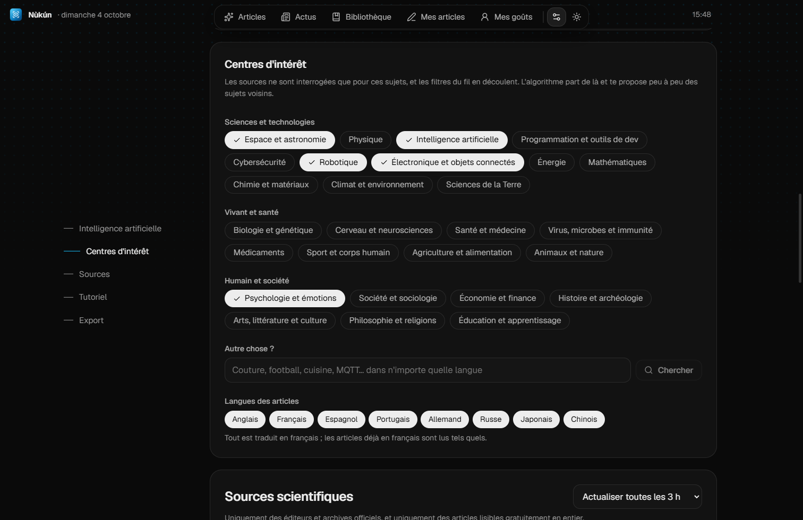

# Nùkún

*Nùkún* veut dire « l'œil » en fongbè. Application de bureau (Windows) pour suivre la recherche et l'actualité officielle sur les sujets qui t'intéressent, quels qu'ils soient : articles en libre accès traduits en français, et un fil de recommandations qui part de tes centres d'intérêt puis apprend de tes lectures.


| Premier lancement : tes centres d'intérêt | Lecture traduite et discussion avec l'IA |
|---|---|
|  |  |



## Installer

Lance `release/Nukun-Setup-1.0.0.exe`. L'installateur crée un raccourci « Nùkún » sur le Bureau et dans le menu Démarrer (la recherche Windows le trouve aussi en tapant « nukun », sans accents).

Si l'ancienne version « Veille Scientifique » est installée, désinstalle-la : Nùkún reprend automatiquement ses articles, traductions et préférences au premier lancement.

## Français et anglais

L'app existe en français et en anglais : au premier lancement elle prend la langue de Windows, et l'écran d'accueil comme les Réglages permettent d'en changer. Cette langue est aussi celle des traductions, des explications et de la discussion : un lecteur anglophone lit les articles anglais tels quels, et les autres (français, espagnol, japonais…) traduits en anglais. Les mémoires de traduction sont séparées par langue, et les titres des cartes sont gardés dans chaque langue, si bien qu'un aller-retour ne coûte rien. L'installateur suit aussi la langue de Windows.

Les textes de l'interface sont écrits en français dans le code et traduits par un dictionnaire (`src/shared/i18n-en.ts`) ; `npm run i18n:check` liste ceux qui n'ont pas encore leur version anglaise.

## Mises à jour

L'app vérifie au lancement, puis toutes les 6 heures, si une nouvelle version est publiée dans les *Releases* GitHub du dépôt. Elle la télécharge en arrière-plan (seulement ce qui a changé), puis une fenêtre propose « Mettre à jour » : rien ne s'installe sans ce clic, et la proposition revient à chaque lancement. Avec l'économie de données, le téléchargement attend aussi un clic. Le dépôt doit être public pour que les apps installées voient les versions.

Publier une version : augmenter `version` dans `package.json`, puis `npm run release` (construit l'installateur et le publie avec `gh`).

## Sources

arXiv, Europe PMC (PubMed Central), bioRxiv, medRxiv, PLOS, eLife, NASA Science, Nature Communications et Scientific Reports, Science Advances, OpenAlex, Semantic Scholar, PsyArXiv, HAL et SciELO. Les articles sont trouvés par les API officielles ; le texte intégral (page web, XML ou PDF en libre accès) est ensuite téléchargé sur le site de l'éditeur. Seuls les articles lisibles gratuitement en entier apparaissent dans le fil.

**Centres d'intérêt.** Au premier lancement, avant tout chargement, tu choisis au moins 3 sujets parmi 27 (espace, IA, santé, économie, histoire, sport…) ou tu cherches n'importe quoi d'autre (« couture », « football », « MQTT », dans n'importe quelle langue) : l'app propose alors les sujets de recherche OpenAlex correspondants. Seules les sources et disciplines liées à tes choix sont interrogées, les filtres des deux fils sont tes centres d'intérêt, et les articles sont classés par OpenAlex à partir de leur DOI. Articles en **8 langues** (anglais, français, espagnol, portugais, allemand, russe, japonais, chinois).

## Recommandations par le sens

En plus des mots, l'app compare le **sens** des articles, dans toutes les langues : un article allemand sur la solitude est reconnu comme proche d'articles anglais sur les émotions, même sans aucun mot en commun. Un petit modèle multilingue (multilingual-e5-small, 130 Mo, téléchargé une seule fois au premier lancement) tourne sur le processeur du PC : pas de carte graphique, pas de clé, pas de coût. Sans connexion au premier lancement, le fil se base sur les mots en attendant.

Limite connue : le sens sert à **classer** le fil, pas aux **filtres**. Un filtre (« Psychologie et émotions »…) suit la discipline donnée par OpenAlex à chaque article ; un article mal classé par OpenAlex (par exemple de la linguistique rangée en psychologie) peut donc apparaître sous un filtre, même s'il descend dans le fil « Tout ».

## IA

Mode par défaut : **Hybride**, sans aucun coût.

- **Google (gratuit)** traduit le gros du texte. Colle ta clé AI Studio dans les Réglages. L'app alterne entre plusieurs modèles gratuits (Gemini Flash, Gemma 4, Flash-Lite), car chacun a son propre quota journalier.
- **Ton abonnement Claude** (via Claude Code, déjà connecté sur le PC) prépare le lexique de chaque article, prend les passages très techniques et corrige les traductions qui échouent aux contrôles automatiques.
- **L'IA locale** (Ollama) sert de relais hors ligne ou quand les quotas sont atteints. L'app détecte la carte graphique et conseille le modèle adapté à sa mémoire (`aya-expanse:8b` pour 8 Go, des modèles plus gros sur les PC plus puissants).
- Sans Claude Code installé, l'app le détecte et fonctionne avec Google et l'IA locale.

**Mémoire du lexique** : un terme technique décidé une fois (gardé en anglais ou traduit, avec sa définition) est réutilisé dans tous les articles. L'IA ne prépare que les termes nouveaux, et un article déjà bien couvert n'a plus besoin d'elle pour son lexique ; un même terme se lit aussi de la même façon partout.

**Perspective** : partager cette mémoire (et celle des traductions) entre tous les utilisateurs grâce à un petit serveur gratuit, pour que personne ne fasse traduire deux fois la même chose.

Traduction « comme un navigateur » : seuls les passages affichés à l'écran (plus un écran d'avance) sont traduits. Chaque traduction est gardée dans une mémoire partagée entre tous les articles : rien n'est jamais payé ni demandé deux fois. Le bouton « Tout traduire » prépare un article entier pour plus tard.

## Utilisation

Au premier lancement : le choix des centres d'intérêt, puis une **visite guidée** qui met en lumière chaque zone de l'app (fil, lecteur, réglages de l'IA, centres d'intérêt, sources). Elle se relance depuis les Réglages.

- **Articles** : les publications de chercheurs. Le fil recommandé, qui se charge à l'infini en descendant. Un filtre par centre d'intérêt. Le fil part de tes choix, puis ouvrir, lire jusqu'au bout, aimer, sauvegarder ou écarter un article ajuste les recommandations. Régulièrement, une « découverte » vient d'un domaine voisin ; si tu en lis souvent, l'app te propose de l'ajouter à tes centres d'intérêt. Une place revient aussi aux articles des autres langues.
- **Actus** : les actualités officielles liées à tes centres d'intérêt, dans un fil séparé. Espace : NASA, ESA. Santé : Inserm. Science et société : CNRS (trié par sujet). Programmation et IA : blogs officiels de GitHub, VS Code, TypeScript, Node.js, React, Rust, Kotlin, Android, Chrome, Docker et Mozilla. Quand un flux ne contient qu'un résumé, l'article est extrait de la page officielle avec Readability (le mode lecture de Firefox).
- **Lecteur** : affichage en français, côte à côte ou en version originale (et PDF quand il existe). L'icône de langue sur un paragraphe affiche l'original. Le lexique liste les termes techniques gardés en anglais. L'onglet **Discussion** permet de poser des questions sur l'article : l'IA répond à partir de son texte. Sélectionne un passage puis « Expliquer » pour une explication simple, ou clique sur « Expliquer cette figure » sous une figure : l'IA lit l'image et sa légende. Explications et conversations sont gardées avec l'article.
- **Mes articles** : rédige ton article à partir de ta lecture, puis exporte-le en `.mdx` (même format que le portfolio) ou copie-le pour un post.

## Développement

Prérequis : Node.js 22+. Optionnel : Ollama et Claude Code installés sur le PC.

```bash
npm install
npm run dev        # lancer en mode développement
npm run typecheck  # vérifier les types
npm run dist       # construire l'installateur Windows dans release/
npm run icon       # régénérer les icônes depuis resources/icon.svg
```

L'architecture (sources, formats de texte intégral, traduction hybride, mémoire de traduction, recommandations, stockage) est décrite dans [docs/ARCHITECTURE.md](docs/ARCHITECTURE.md).

### Scripts de test

- `scripts/test-sources.mts` : interroge chaque source et affiche le nombre d'articles par domaine (`npx tsx scripts/test-sources.mts [source]`).
- `scripts/test-loader.mts` : charge le texte intégral d'articles de référence pour chaque format.
- `scripts/compare.mjs` : traduit un même article avec plusieurs IA via l'app lancée avec `--remoteDebuggingPort 9555`, pour les comparer.
- `scripts/cdp.mjs` : capture d'écran ou évaluation dans l'app lancée en débogage.
- `scripts/fake-ollama.mjs` : fausse IA locale pour tester la chaîne de traduction sans modèle.

## Licences

Code : MIT. L'icône reprend le pictogramme « scan-eye » de [Lucide](https://lucide.dev) (licence ISC), voir `resources/THIRD_PARTY_LICENSES.md`. Les articles affichés restent la propriété de leurs auteurs et éditeurs, sous leurs licences respectives.
